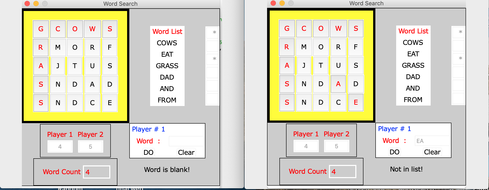

## Final Project For ITEC 3001 at Southwest Tech, Cedar City, Utah 84720.

## Synopsis
My goal was to create a simple word search game using a Graphical User Interface.

## Motivation
The Python class introduced classes and Graphical User Interfaces in the closing chapters.  Given a project time frame of 15 hours, I felt it would demonstrate my comprehension of the material as well as being challenging.

## How to Run
All the code needed to run this project is in the wordsearch.py file.

## Code Sample

'''
        self._checkBox6 = StringVar()
        self._wordIndex = - 1
        self._playerInd = StringVar()
        self._message = ""
        self._score1 = IntVar()
        self._score2 = IntVar()
        self._wordCount = IntVar()
        self._rand = 0
        self._string = StringVar()
        self._playerOne = True
        self._playerTwo = False
        self._valid = False
        self._font = Font(family = "Verdana", size = 15)

        # Board frame.
        self._gamePane = Frame(self, highlightthickness = 5, highlightbackground = "black")
        self._gamePane.grid(row = 3, column = 0)

        # Word list frame.
        self._wordPane = Frame(self, bg = "white")
        self._wordPane.grid(row = 3, column = 10)

        # Checkbox frame.
        self._checkPane = Frame(self, bg = "white")
        self._checkPane.grid(row = 3, column = 12)

        # Command frame.
        self._commandPane = Frame(self, highlightthickness = 1, highlightbackground = "black")
        self._commandPane.grid(row = 10, column = 10)

        # Player frame.
        self._playerPane = Frame(self, bg = "#cccccc", highlightthickness = 1, highlightbackground = "black", padx = 10, pady = 10)
        self._playerPane.grid(row = 10, column = 0)
        self._player1 = Label(self._playerPane, font = self._font, text = "Player 1", bg = "#cccccc", fg = "red")
        self._player1.grid(row = 10, column = 0)
        self._scoreEntry1 = Entry(self._playerPane, textvariable = self._score1, width = 5, justify = "center", state = DISABLED)
'''
